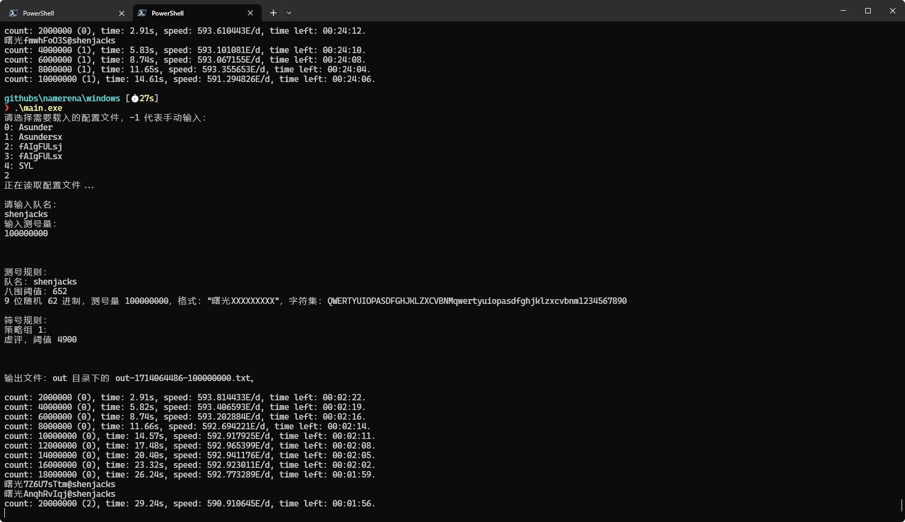

# tswn (miner bench)

## 方法

> --release

`--team shenjacks -q 5500 --end 100000000 --bench`

环境

> 5600x 4.3GHz

## 结果

> 参考 pl



### 0.1.5

> 要命
>
> 不过至少榨干了
>
> 虚评还没榨干呢就是了

```text
❯ .\runs\tswn-015.exe --team shenjacks -q 5500 --end 100000000 --bench
2024-04-25T16:57:24.563330Z  INFO tswn: 输出文件: "./namerena/namerena-shenjacks-2024-04-26_00-57-24.txt"
2024-04-25T16:57:24.563545Z  INFO tswn: 设置线程亲和性成功 4095
2024-04-25T16:57:24.563599Z  INFO tswn: 开始: 0 结尾: 100000000
2024-04-25T16:57:24.563647Z  INFO tswn: 线程数: 1
2024-04-25T16:57:24.563699Z  INFO tswn: 八围预期: 640
2024-04-25T16:57:24.563743Z  INFO tswn: 队伍名: shenjacks
2024-04-25T16:57:24.563785Z  INFO tswn: 输出文件名: "./namerena/namerena-shenjacks-2024-04-26_00-57-24.txt"
2024-04-25T16:57:24.563829Z  INFO tswn: 预期状态输出时间间隔: 10 秒
2024-04-25T16:57:24.563879Z  INFO tswn: 是否启动 benchmark 模式: true
2024-04-25T16:57:24.563922Z  INFO tswn: 开始 benchmark
2024-04-25T16:57:24.578851Z  INFO tswn::cacluate: | 1|Id:          10000|671821.78/s 580.454E/d  0.01⬆️|0  |预计:0:2:28|
2024-04-25T16:57:34.578359Z  INFO tswn::cacluate: | 1|Id:        6728210|671860.35/s 580.487E/d 10.00⬆️|0  |预计:0:2:18|
2024-04-25T16:57:44.575895Z  INFO tswn::cacluate: | 1|Id:       13446810|672032.96/s 580.636E/d 10.00⬆️|0  |预计:0:2:8|
2024-04-25T16:57:54.591460Z  INFO tswn::cacluate: | 1|Id:       20167130|670995.58/s 579.740E/d 10.02⬇️|0  |预计:0:1:58|
2024-04-25T16:58:04.566468Z  INFO tswn::cacluate: | 1|Id:       26877080|672683.34/s 581.198E/d  9.97⬆️|0  |预计:0:1:48|
2024-04-25T16:58:14.569120Z  INFO tswn::cacluate: | 1|Id:       33603910|672512.54/s 581.051E/d 10.00⬇️|0  |预计:0:1:38|
2024-04-25T16:58:24.568515Z  INFO tswn::cacluate: | 1|Id:       40329030|672560.85/s 581.093E/d 10.00⬆️|0  |预计:0:1:28|
2024-04-25T16:58:34.568901Z  INFO tswn::cacluate: | 1|Id:       47054630|672541.67/s 581.076E/d 10.00⬇️|0  |预计:0:1:18|
2024-04-25T16:58:44.567734Z  INFO tswn::cacluate: | 1|Id:       53780040|672627.21/s 581.150E/d 10.00⬆️|0  |预计:0:1:8|
2024-04-25T16:58:54.566817Z  INFO tswn::cacluate: | 1|Id:       60506310|672696.30/s 581.210E/d 10.00⬆️|0  |预计:0:0:58|
2024-04-25T16:59:04.552976Z  INFO tswn::cacluate: | 1|Id:       67233270|673636.33/s 582.022E/d  9.99⬆️|0  |预计:0:0:48|
2024-04-25T16:59:14.573063Z  INFO tswn::cacluate: | 1|Id:       73969630|672293.31/s 580.861E/d 10.02⬇️|0  |预计:0:0:38|
```

### 0.1.4

> 说啥来啥

```text
❯ .\runs\tswn-014.exe --team shenjacks -q 5500 --end 100000000 --bench
2024-04-25T16:41:01.955880Z  INFO tswn: 输出文件: "./namerena/namerena-shenjacks-2024-04-26_00-41-01.txt"
2024-04-25T16:41:01.956097Z  INFO tswn: 设置线程亲和性成功 4095
2024-04-25T16:41:01.956149Z  INFO tswn: 开始: 0 结尾: 100000000
2024-04-25T16:41:01.956194Z  INFO tswn: 线程数: 1
2024-04-25T16:41:01.956238Z  INFO tswn: 八围预期: 640
2024-04-25T16:41:01.956281Z  INFO tswn: 队伍名: shenjacks
2024-04-25T16:41:01.956324Z  INFO tswn: 输出文件名: "./namerena/namerena-shenjacks-2024-04-26_00-41-01.txt"
2024-04-25T16:41:01.956368Z  INFO tswn: 预期状态输出时间间隔: 10 秒
2024-04-25T16:41:01.956414Z  INFO tswn: 是否启动 benchmark 模式: true
2024-04-25T16:41:01.956460Z  INFO tswn: 开始 benchmark
2024-04-25T16:41:01.971405Z  INFO tswn::cacluate: | 1|Id:          10000|671839.83/s 580.470E/d  0.01⬆️|0  |预计:0:2:28|
2024-04-25T16:41:11.993331Z  INFO tswn::cacluate: | 1|Id:        6728390|670375.96/s 579.205E/d 10.02⬇️|0  |预计:0:2:19|
2024-04-25T16:41:21.985595Z  INFO tswn::cacluate: | 1|Id:       13432140|670904.21/s 579.661E/d  9.99⬆️|0  |预计:0:2:9|
2024-04-25T16:41:32.000630Z  INFO tswn::cacluate: | 1|Id:       20141180|669903.99/s 578.797E/d 10.01⬇️|0  |预计:0:1:59|
2024-04-25T16:41:41.977727Z  INFO tswn::cacluate: | 1|Id:       26840210|671448.43/s 580.131E/d  9.98⬆️|0  |预计:0:1:48|
2024-04-25T16:41:51.971939Z  INFO tswn::cacluate: | 1|Id:       33554690|671844.32/s 580.473E/d  9.99⬆️|0  |预计:0:1:38|
2024-04-25T16:42:01.998885Z  INFO tswn::cacluate: | 1|Id:       40273130|670045.99/s 578.920E/d 10.03⬇️|0  |预计:0:1:29|
2024-04-25T16:42:11.987622Z  INFO tswn::cacluate: | 1|Id:       46973580|670807.82/s 579.578E/d  9.99⬆️|0  |预计:0:1:19|
2024-04-25T16:42:21.991526Z  INFO tswn::cacluate: | 1|Id:       53681650|670555.81/s 579.360E/d 10.00⬇️|0  |预计:0:1:9|
2024-04-25T16:42:31.964748Z  INFO tswn::cacluate: | 1|Id:       60387200|672365.87/s 580.924E/d  9.97⬆️|0  |预计:0:0:58|
2024-04-25T16:42:41.948492Z  INFO tswn::cacluate: | 1|Id:       67110850|673467.34/s 581.876E/d  9.98⬆️|0  |预计:0:0:48|
2024-04-25T16:42:51.961452Z  INFO tswn::cacluate: | 1|Id:       73845520|672602.58/s 581.129E/d 10.01⬇️|0  |预计:0:0:38|
2024-04-25T16:43:01.963617Z  INFO tswn::cacluate: | 1|Id:       80571540|672464.08/s 581.009E/d 10.00⬇️|0  |预计:0:0:28|
2024-04-25T16:43:11.971626Z  INFO tswn::cacluate: | 1|Id:       87296180|671933.03/s 580.550E/d 10.01⬇️|0  |预计:0:0:18|
```

### 0.1.3

> 可算至少没有如升了

```text
❯ .\runs\tswn-013.exe --team shenjacks -q 5500 --end 100000000 --bench
2024-04-25T16:34:48.083060Z  INFO tswn: 输出文件: "./namerena/namerena-shenjacks-2024-04-26_00-34-48.txt"
2024-04-25T16:34:48.083292Z  INFO tswn: 设置线程亲和性成功 4095
2024-04-25T16:34:48.083349Z  INFO tswn: 开始: 0 结尾: 100000000
2024-04-25T16:34:48.083397Z  INFO tswn: 线程数: 1
2024-04-25T16:34:48.083441Z  INFO tswn: 八围预期: 640
2024-04-25T16:34:48.083485Z  INFO tswn: 队伍名: shenjacks
2024-04-25T16:34:48.083528Z  INFO tswn: 输出文件名: "./namerena/namerena-shenjacks-2024-04-26_00-34-48.txt"
2024-04-25T16:34:48.083582Z  INFO tswn: 预期状态输出时间间隔: 10 秒
2024-04-25T16:34:48.083630Z  INFO tswn: 是否启动 benchmark 模式: true
2024-04-25T16:34:48.083675Z  INFO tswn: 开始 benchmark
2024-04-25T16:34:48.098900Z  INFO tswn::cacluate: | 1|Id:          10000|658761.53/s 569.170E/d  0.02⬆️|0  |预计:0:2:31|
2024-04-25T16:34:57.961474Z  INFO tswn::cacluate: | 1|Id:        6597610|667946.59/s 577.106E/d  9.86⬆️|0  |预计:0:2:19|
2024-04-25T16:35:07.951406Z  INFO tswn::cacluate: | 1|Id:       13277070|668626.78/s 577.694E/d  9.99⬆️|0  |预计:0:2:9|
2024-04-25T16:35:17.945802Z  INFO tswn::cacluate: | 1|Id:       19963330|669008.84/s 578.024E/d  9.99⬆️|0  |预计:0:1:59|
2024-04-25T16:35:27.954792Z  INFO tswn::cacluate: | 1|Id:       26653410|668414.35/s 577.510E/d 10.01⬇️|0  |预计:0:1:49|
2024-04-25T16:35:37.947746Z  INFO tswn::cacluate: | 1|Id:       33337550|668892.23/s 577.923E/d  9.99⬆️|0  |预计:0:1:39|
2024-04-25T16:35:47.938790Z  INFO tswn::cacluate: | 1|Id:       40026470|669498.85/s 578.447E/d  9.99⬆️|0  |预计:0:1:29|
2024-04-25T16:35:57.982945Z  INFO tswn::cacluate: | 1|Id:       46721450|666561.93/s 575.910E/d 10.04⬇️|0  |预计:0:1:19|
2024-04-25T16:36:07.959973Z  INFO tswn::cacluate: | 1|Id:       53387060|668105.84/s 577.243E/d  9.98⬆️|0  |预计:0:1:9|
2024-04-25T16:36:17.936227Z  INFO tswn::cacluate: | 1|Id:       60068110|669702.86/s 578.623E/d  9.98⬆️|0  |预计:0:0:59|
2024-04-25T16:36:27.934845Z  INFO tswn::cacluate: | 1|Id:       66765130|669801.76/s 578.709E/d 10.00⬆️|0  |预计:0:0:49|
```

### 0.1.2

> 咋到了这边就如改呢

```text
❯ .\runs\tswn-012.exe --team shenjacks -q 5500 --end 100000000 --bench
2024-04-25T16:29:10.751123Z  INFO tswn: 输出文件: "./namerena/namerena-shenjacks-2024-04-26_00-29-10.txt"
2024-04-25T16:29:10.751340Z  INFO tswn: 设置线程亲和性成功 4095
2024-04-25T16:29:10.751392Z  INFO tswn: 开始: 0 结尾: 100000000
2024-04-25T16:29:10.751437Z  INFO tswn: 线程数: 1
2024-04-25T16:29:10.751481Z  INFO tswn: 八围预期: 640
2024-04-25T16:29:10.751525Z  INFO tswn: 队伍名: shenjacks
2024-04-25T16:29:10.751569Z  INFO tswn: 输出文件名: "./namerena/namerena-shenjacks-2024-04-26_00-29-10.txt"
2024-04-25T16:29:10.751616Z  INFO tswn: 预期状态输出时间间隔: 10 秒
2024-04-25T16:29:10.751663Z  INFO tswn: 是否启动 benchmark 模式: true
2024-04-25T16:29:10.751706Z  INFO tswn: 开始 benchmark
2024-04-25T16:29:10.769613Z  INFO tswn::cacluate: | 1|Id:          10000|559869.66/s 483.727E/d  0.02⬆️|0  |预计:0:2:58|
2024-04-25T16:29:20.792120Z  INFO tswn::cacluate: | 1|Id:        5608690|558618.22/s 482.646E/d 10.02⬇️|0  |预计:0:2:48|
2024-04-25T16:29:30.783691Z  INFO tswn::cacluate: | 1|Id:       11194870|559095.37/s 483.058E/d  9.99⬆️|0  |预计:0:2:38|
2024-04-25T16:29:40.782174Z  INFO tswn::cacluate: | 1|Id:       16785820|559186.84/s 483.137E/d 10.00⬆️|0  |预计:0:2:28|
2024-04-25T16:29:50.778334Z  INFO tswn::cacluate: | 1|Id:       22377680|559406.94/s 483.328E/d 10.00⬆️|0  |预计:0:2:18|
2024-04-25T16:30:00.784518Z  INFO tswn::cacluate: | 1|Id:       27971740|559066.52/s 483.033E/d 10.01⬇️|0  |预计:0:2:8|
2024-04-25T16:30:10.782641Z  INFO tswn::cacluate: | 1|Id:       33562400|559177.10/s 483.129E/d 10.00⬆️|0  |预计:0:1:58|
2024-04-25T16:30:20.780848Z  INFO tswn::cacluate: | 1|Id:       39154170|559283.24/s 483.221E/d 10.00⬆️|0  |预计:0:1:48|
2024-04-25T16:30:30.780561Z  INFO tswn::cacluate: | 1|Id:       44747000|559305.48/s 483.240E/d 10.00⬆️|0  |预计:0:1:38|
2024-04-25T16:30:40.788376Z  INFO tswn::cacluate: | 1|Id:       50340050|558874.38/s 482.867E/d 10.01⬇️|0  |预计:0:1:28|
2024-04-25T16:30:50.781088Z  INFO tswn::cacluate: | 1|Id:       55928790|559287.46/s 483.224E/d  9.99⬆️|0  |预计:0:1:18|
2024-04-25T16:31:00.787130Z  INFO tswn::cacluate: | 1|Id:       61521660|558955.19/s 482.937E/d 10.01⬇️|0  |预计:0:1:8|
2024-04-25T16:31:10.774828Z  INFO tswn::cacluate: | 1|Id:       67111210|559649.42/s 483.537E/d  9.99⬆️|0  |预计:0:0:58|
2024-04-25T16:31:20.780385Z  INFO tswn::cacluate: | 1|Id:       72707700|559344.17/s 483.273E/d 10.01⬇️|0  |预计:0:0:48|
2024-04-25T16:31:30.789669Z  INFO tswn::cacluate: | 1|Id:       78301140|558831.29/s 482.830E/d 10.01⬇️|0  |预计:0:0:38|
2024-04-25T16:31:40.769888Z  INFO tswn::cacluate: | 1|Id:       83889450|559944.67/s 483.792E/d  9.98⬆️|0  |预计:0:0:28|
2024-04-25T16:31:50.780890Z  INFO tswn::cacluate: | 1|Id:       89488890|559334.72/s 483.265E/d 10.01⬇️|0  |预计:0:0:18|
```

### 0.1.1

```text
❯ .\runs\tswn-011.exe --team shenjacks -q 5500 --end 100000000 --bench
2024-04-25T16:22:43.103952Z  INFO tswn: 输出文件: "./namerena/namerena-shenjacks-2024-04-26_00-22-43.txt"
2024-04-25T16:22:43.104169Z  INFO tswn: 设置线程亲和性成功 4095
2024-04-25T16:22:43.104223Z  INFO tswn: 开始: 0 结尾: 100000000
2024-04-25T16:22:43.104270Z  INFO tswn: 线程数: 1
2024-04-25T16:22:43.104313Z  INFO tswn: 八围预期: 640
2024-04-25T16:22:43.104357Z  INFO tswn: 队伍名: shenjacks
2024-04-25T16:22:43.104401Z  INFO tswn: 输出文件名: "./namerena/namerena-shenjacks-2024-04-26_00-22-43.txt"
2024-04-25T16:22:43.104445Z  INFO tswn: 预期状态输出时间间隔: 10 秒
2024-04-25T16:22:43.104494Z  INFO tswn: 是否启动 benchmark 模式: true
2024-04-25T16:22:43.104539Z  INFO tswn: 开始 benchmark
2024-04-25T16:22:43.122617Z  INFO tswn::cacluate: | 1|Id:          10000|554545.05/s 479.127E/d  0.02⬆️|0  |预计:0:3:0|
2024-04-25T16:22:53.036437Z  INFO tswn::cacluate: | 1|Id:        5555450|559371.31/s 483.297E/d  9.91⬆️|0  |预计:0:2:48|
2024-04-25T16:23:03.037739Z  INFO tswn::cacluate: | 1|Id:       11149160|559304.37/s 483.239E/d 10.00⬇️|0  |预计:0:2:38|
2024-04-25T16:23:13.057818Z  INFO tswn::cacluate: | 1|Id:       16742200|558189.62/s 482.276E/d 10.02⬇️|0  |预计:0:2:29|
2024-04-25T16:23:23.030494Z  INFO tswn::cacluate: | 1|Id:       22324090|559724.72/s 483.602E/d  9.97⬆️|0  |预计:0:2:18|
2024-04-25T16:23:33.049657Z  INFO tswn::cacluate: | 1|Id:       27921330|558661.02/s 482.683E/d 10.02⬇️|0  |预计:0:2:9|
2024-04-25T16:23:43.043393Z  INFO tswn::cacluate: | 1|Id:       33507940|559017.44/s 482.991E/d  9.99⬆️|0  |预计:0:1:58|
2024-04-25T16:23:53.050200Z  INFO tswn::cacluate: | 1|Id:       39098110|558643.05/s 482.668E/d 10.01⬇️|0  |预计:0:1:49|
2024-04-25T16:24:03.037297Z  INFO tswn::cacluate: | 1|Id:       44684540|559371.02/s 483.297E/d  9.99⬆️|0  |预计:0:1:38|
2024-04-25T16:24:13.028762Z  INFO tswn::cacluate: | 1|Id:       50278250|559855.15/s 483.715E/d  9.99⬆️|0  |预计:0:1:28|
```
